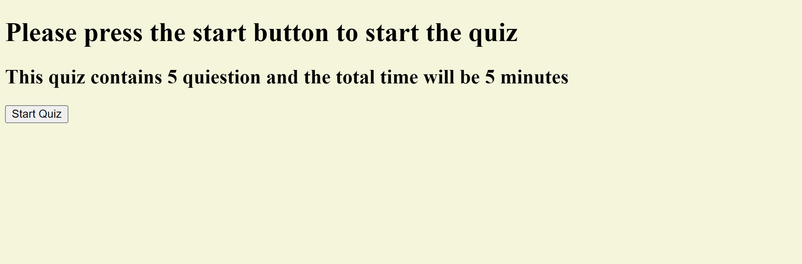
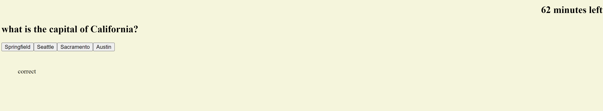

# Title of the Project:

# Quiz Game

## Description:

## This quiz consistes of five questions, the user will have 80 seconds to answer these 5 question which are about capitals names in the US. The user will have a multiple choice of 4 options and will see if the answer is coorect or wrong once the user answers. I used java script, jquery, html, and css to build this quiz.
## Table of Content:

1. [Installation Instructions](#installation)
2. [Usage Information](#usage)
3. [License Information](#License)
4. [Contribution](#contributing)
5. [Tests](#tests)
6. [Questions](#questions)

## installation:

## N/A

## Usage:

## To start aplying JS, Jquery on building algorithms

## License: N/A

## contributing:

## Built solo

## Tests:

## N/A

## Questions:

you can finde my GitHub at:

## [wasim202](https://github.com/wasim202)

If you have any questions please email me at:

## wsmohd87@gmail.com

